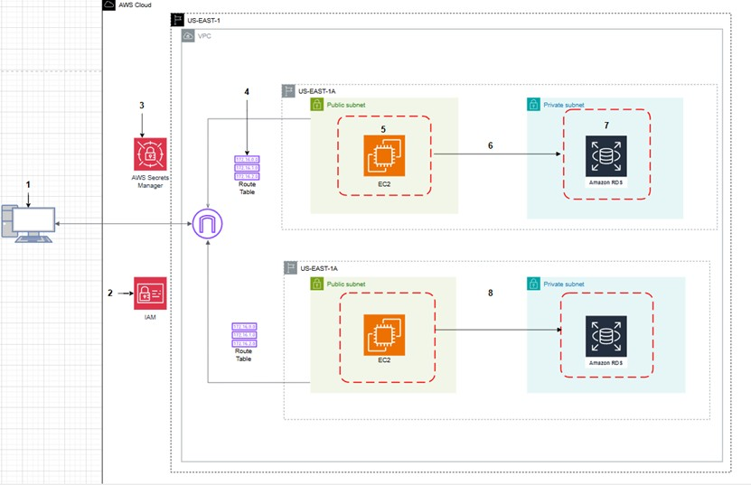

# AWS Migration

Scenario:
You are a Cloud Engineer Consultant working with TechHealth Inc., a healthcare technology company that built their AWS infrastructure manually through the AWS Console 5 years ago. They have a patient portal web application that needs to be modernized and migrated to Infrastructure as Code.

Goal: Rebuild a 5 year old AWS enviroment that was configured manually through AWS Console

Architecture:

AWS services used:
AWS CDK - Typecript
Amazon EC2
Amazon RDS (MySQL)
AWS VPC with Public/Private Subnets (2 AZ)
IAM Roles & Policies
Secrets Manager
AWS CLI + SSH to test EC2 and RDS connection

Security:
IAM roles applies with "least privilege"
EC2 only accessiable via SSH
RDS is no publicly accessiable **Only accessiable from EC2 one way**
Security groups restrict traffic to only (22, 80, 3306)
RDS database credentials is stored in AWS Secrets Manager

Network:
2 Availability Zones (Fault tolerant and High availability)
EC2 is in Public Subnet
RDS is in Private Subnet
No NAT Gateway (Reduce cost)

Testign to connect to EC2 and RDS:
Connected to EC2 using ssh -i /path/to/file/pem user ec2-user@**Public IP Address**
Installed MySQL client and connected to RDS using mtsql -h ....
Verified with "SHOW DATABASES;" to confirm connection
Confirmed RDS was deployed in private subnet via console

Cost:
Used t3.micro for EC2
Used db.t3.micro for RDS
Avoided NAT Gate for cost

Lastly the most important DESTROY:
used ''bash'' cdk destroy to destroy project

----------------------------------------------------------------------------------------------------------------

This is a blank project for CDK development with TypeScript.

The `cdk.json` file tells the CDK Toolkit how to execute your app.

## Useful commands

* `npm run build`   compile typescript to js
* `npm run watch`   watch for changes and compile
* `npm run test`    perform the jest unit tests
* `npx cdk deploy`  deploy this stack to your default AWS account/region
* `npx cdk diff`    compare deployed stack with current state
* `npx cdk synth`   emits the synthesized CloudFormation template
